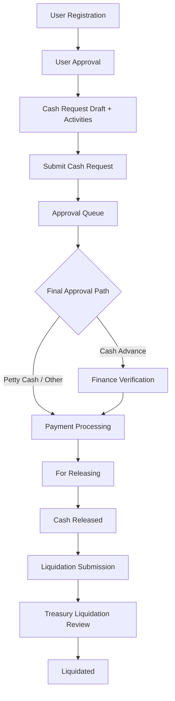

# System Workflow Documentation

## 1. Overview
This document describes the full workflow of the system from user registration up to cash request liquidation, including:
- actor responsibilities
- queue/module handoffs
- status and `status_remarks` transitions
- approval branching rules
- automation workflows (scheduler)

## 2. Workflow Actors
- Requestor (employee/user)
- Department Head / Assigned Approver Roles
- Finance Staff
- Treasury Manager
- Treasury Staff
- Super Admin
- System Scheduler

## 3. End-to-End Workflow (High Level)

## 4. Workflow 0: User Registration and Activation

### 4.1 Registration
Actor: Requestor

1. User registers via custom Filament register page.
2. Email must match company domain regex (`@mcasiafoodtrade.ph`).
3. Account is created with default user status `pending`.
4. `ConfirmRegistrationJob` is dispatched.
5. Department heads of the selected department receive DB and email notifications.

### 4.2 User Approval
Actor: Department Head / Super Admin (resource: `UserApprovalResource`)

1. Pending user appears in `User Request (For Approval)`.
2. Approver chooses:
   - Approve: set `users.status = approved`, set `review_by`, `review_at`, dispatch `ApproveUserRegistrationJob`.
   - Reject: set `users.status = disapproved`, set rejection reason, dispatch `RejectUserRegistrationJob`.

### 4.3 Login Gatekeeping
Enforced by:
- `CustomLogin` page
- `ForceLogoutAfterRegistration` middleware

Behavior:
- Non-approved users cannot stay authenticated and are redirected to login with error.

## 5. Workflow 1: Cash Request Creation and Submission

### 5.1 Draft Creation
Actor: Requestor

Entry page: `CreateActivityListWithTable`

1. User creates one or more activity rows.
2. System maintains a draft `cash_requests` row with `status_remarks = null`.
3. Duplicate active request by same nature is blocked (except `liquidated/cancelled/rejected`).

### 5.2 Submission
Actor: Requestor

1. User clicks `Submit Cash Request`.
2. System validates:
   - at least one activity
   - amount constraints (petty cash cap from active approval rule)
3. System updates request:
   - `status = pending`
   - `status_remarks = Request Submitted`
4. System initializes approval rows via `CashRequestApprovalFlowService::initializeApprovals`.
5. System notifies approvers (department head + super admins).

## 6. Workflow 2: Approval Queue and Matrix Resolution

### 6.1 Approval Rule Resolution
Performed by `CashRequestApprovalFlowService`:
- Match by `nature_of_request`
- Match by amount range (`min_amount`, `max_amount`)
- Create `cash_request_approvals` rows per role step

### 6.2 Approver Visibility
`ForApprovalRequestResource` only shows requests pending for current user's role(s).

### 6.3 Approve Action
Actor: Assigned Approver Role

1. Pending approval row marked `approved`.
2. Request set to `status = in progress`.
3. If more steps remain, request stays in approval flow.
4. If final step:
   - for `cash advance`: `status_remarks = For Finance Verification`
   - otherwise: `status_remarks = For Payment Processing`
5. `ApproveCashRequestJob` dispatched on final approval.

### 6.4 Reject Action
Actor: Assigned Approver Role

1. Pending approval row marked `declined`.
2. Request updated:
   - `status = rejected`
   - `status_remarks = role-based rejected remark`
   - `reason_for_rejection` saved
3. `RejectCashRequestJob` dispatched.

### 6.5 Activity-Level Rejection During Approval
Actor: Approver

1. Individual activity can be rejected.
2. Request total recalculated from remaining activities.
3. If no remaining valid activity:
   - whole request becomes `rejected`.

## 7. Workflow 3: Finance Verification (Cash Advance Path)

Resource: `ForFinanceVerificationResource`
Queue criteria:
- `status = in progress`
- `status_remarks = For Finance Verification`

### 7.1 Approve
Actor: Finance Staff

1. Voucher number required.
2. Request updated:
   - `voucher_no`
   - `status = in progress`
   - `status_remarks = For Payment Processing`

### 7.2 Reject
Actor: Finance Staff

1. Save rejection reason.
2. Request updated:
   - `status = rejected`
   - finance rejection remark
   - `reason_for_rejection`
3. `RejectCashRequestJob` dispatched.

## 8. Workflow 4: Payment Processing (Treasury Processing)

Resource: `PaymentProcessResource`
Queue criteria:
- `status = in progress`
- `status_remarks = For Payment Processing`

### 8.1 Optional Override
Actor: user with `can-override-payment-process-request` or super admin

Effect:
- `is_override = true`
- notify treasury manager

### 8.2 Treasury Manager Approval
Condition:
- in payment-processing queue
- `is_override = true`
- `is_approved_by_treasury_manager = false`

Effect:
- set `is_approved_by_treasury_manager = true`
- notify treasury staff

### 8.3 Treasury Staff Final Processing
Condition:
- in payment-processing queue
- `is_override = true`
- treasury manager already approved
- for cash advance: disbursement must be set

Actions:
1. Set/confirm disbursement details (`check` or `payroll`).
2. Save release schedule and remarks into `for_cash_releases`.
3. Compute `due_date` based on `aging_field` setting (fallback 3 days).
4. Update request:
   - `status = approved`
   - `status_remarks = treasury approved remark`
5. Dispatch `ApproveCashRequestByTreasuryJob` (moves remark to `For Releasing` after email send).

### 8.4 Treasury Rejection
Actor: Treasury

Effect:
- request set to `rejected` with treasury rejection remark
- `RejectCashRequestJob` dispatched

## 9. Workflow 5: For Releasing and Cash Release

Resource: `ForCashReleaseResource`
Queue criteria:
- linked request `status = approved`
- linked request `status_remarks = For Releasing`

### 9.1 Release Action
Actor: Treasury release processor

1. Update release row:
   - `released_by`
   - `date_released`
2. Update request:
   - `status = released`
   - `status_remarks = role-based release remark`
   - `date_released`
3. Create `for_liquidations` record.
4. Dispatch `ReleaseCashRequestByTreasuryJob` (sets remark to `For Liquidation` after mail).

### 9.2 Reject Action
Actor: Treasury release processor

Effect:
- request set to `rejected` with treasury rejection remark and reason
- `RejectCashRequestJob` dispatched

## 10. Workflow 6: Liquidation Submission and Finalization

### 10.1 Requestor Liquidation Submission
Entry action from `CashRequestResource` when:
- `status = released`
- `status_remarks = For Liquidation`

Using `LiquidationService`:
1. Save receipt line items (`liquidation_receipts`).
2. Attach media to `liquidation-receipts` collection.
3. Compute totals:
   - `total_liquidated`
   - `total_change` (reimburse)
   - `missing_amount` (cash return)
4. Set request remark to `Liquidation Receipt Submitted`.
5. Notify treasury team.

### 10.2 Treasury Liquidation Review
Resource: `ForLiquidationResource`

Gate for processing:
- request `status = released`
- request `status_remarks = Liquidation Receipt Submitted`
- liquidation `is_override = true`

Actions:
- Override liquidation receipt totals/remarks (if permitted).
- Liquidate (manager): set request
  - `status = liquidated`
  - `status_remarks = Liquidated`
  - `date_liquidated`
- Reject liquidation: revert request to
  - `status = released`
  - `status_remarks = For Liquidation`
  - set rejection reason

## 11. Scheduled System Workflows

### 11.1 Update Liquidation Aging
Schedule:
- daily `00:05` Asia/Manila

Logic:
- For requests `released` + `For Liquidation` and overdue due date
- Recompute `for_liquidations.aging`

### 11.2 Auto-Cancel Unclaimed Release
Schedule:
- every 5 minutes

Logic:
- If release window end has passed and not claimed (`date_released` null)
- Request updated to:
  - `status = cancelled`
  - `status_remarks = Unclaimed`
  - cancellation reason set

## 12. Status Transition Matrix (Cash Request)

| Stage | Status | Status Remarks |
|---|---|---|
| Draft | `pending` | `null` |
| Submitted | `pending` | `Request Submitted` |
| Approval in progress | `in progress` | Role-approved remarks while routing |
| Post-final approval (cash advance) | `in progress` | `For Finance Verification` |
| Post-finance approval | `in progress` | `For Payment Processing` |
| Post-final approval (non-cash-advance path) | `in progress` | `For Payment Processing` |
| Treasury processed for release | `approved` | treasury approved remark |
| Release queue | `approved` | `For Releasing` |
| Released | `released` | treasury released remark -> then `For Liquidation` |
| Liquidation submitted | `released` | `Liquidation Receipt Submitted` |
| Final liquidation | `liquidated` | `Liquidated` |
| Rejected at any stage | `rejected` | Role/context rejected remark |
| Cancelled by user/system | `cancelled` | cancellation/`Unclaimed` |

## 13. Role-Based Responsibility Map

| Role | Main Workflow Responsibility |
|---|---|
| Requestor | Register, create/submit request, submit liquidation receipts |
| Department Head / Approver Roles | Approve or reject in approval queue |
| Finance Staff | Verify and route to payment processing, or reject |
| Treasury Manager | Approve override-gated payment process; liquidate final requests |
| Treasury Staff | Set disbursement, schedule releasing, release cash |
| Super Admin | Global override access and broad visibility |
| Scheduler | Aging updates and unclaimed cancellation automation |

## 14. Workflow Control Rules
- Approval routing is rule-driven by nature + amount (`approval_rules`).
- Queue module visibility is determined by `status` + `status_remarks` + role filters.
- Override flags gate treasury processing and liquidation actions.
- Activity-level rejection can collapse a request into full rejection if no activities remain.

## 15. Operational Notes
- Queue worker must run for mail and async transition updates.
- Scheduler must run every minute to trigger workflow automation.
- `status_remarks` is critical for queue handoff and should be treated as a workflow state marker.

